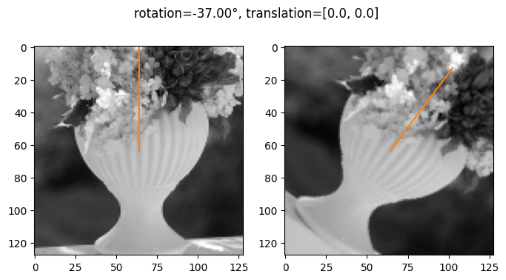

# rotation-net
adaption of [HomographyNet](https://arxiv.org/pdf/1606.03798.pdf) (regression head) by DeTone et al. for learning rotations of images with pytorch/tensorflow


## Content of repo
### Image Pairs Generation
[01_data_generation.ipynb](01_data_generation.ipynb) cut out grayscale patch A from MS COCO image and randomly rotate patch A between -180° and 180° to get patch B



### Training
[02_network_training_torch.ipynb](02_network_training_torch.ipynb) / [02_network_training_tf.ipynb](02_network_training_tf.ipynb) train and evaluate HomographyNet with train and val image pairs


### Test
[03_network_inference_torch.ipynb](03_network_inference_torch.ipynb) / [03_network_inference_tf.ipynb](03_network_inference_tf.ipynb) test with test pairs and calculate rotation error
* mean rotation error: 4.1°
* median rotation error: 2.5°


## Prerequisites
* download [MS COCO dataset](https://cocodataset.org/#download) (train/val/test) and unzip to ```data/``` folder
* (optional) download trained model [here](https://drive.google.com/drive/folders/1UBh2fX9am77awOvVaEN2x_tiD78i2fWd?usp=sharing)

## Credits
* [mazenmel/Deep-homography-estimation-Pytorch](https://github.com/mazenmel/Deep-homography-estimation-Pytorch) (data generation, pytorch implementation)
* [richard-guinto/homographynet](https://github.com/richard-guinto/homographynet) (tensorflow implementation)